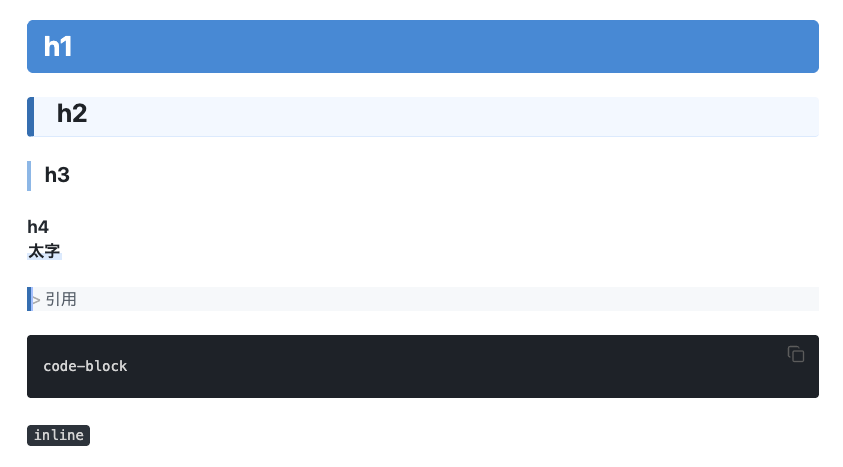

## CSS
ファイルパス
obsidian/.obsidian/snippets/crossnote-light.css

外観設定
- テーマはデフォルトを利用。CSSが他のテーマと被らないようにする
- CSS利用をONにする

青ベースのライトモード用
obsidianをwiki的な感じで閲覧しやすくする

イメージ

```css
/*
  crossnote (markdown-preview-enhanced) の style.less ライトモード設定を
  Obsidian の Reading View 向けに移植したスニペット。
  元ファイル: ~/.local/state/crossnote/style.less

  .theme-light 配下でのみ適用されるようにしてあるので、
  ダークテーマ使用時は無効化される（オフに戻すには
  Settings > Appearance > CSS snippets でトグルを切るか、
  このファイルを snippets フォルダから削除するだけでよい）。
*/

/* ── Layout ────────────────────────────────────────────────────────── */
.theme-light .markdown-preview-view {
  padding: 1rem 2rem;
}

/* ── Base Typography ──────────────────────────────────────────────── */
.theme-light .markdown-preview-view {
  font-size: 17px;
  line-height: 1.75;
  color: #24292f;
  background-color: #ffffff;
  font-family: -apple-system, BlinkMacSystemFont, 'Segoe UI', 'Noto Sans', sans-serif;
  word-spacing: 0.02em;
}

/* ── Paragraphs ───────────────────────────────────────────────────── */
.theme-light .markdown-preview-view p {
  margin-top: 0;
  margin-bottom: 1.25em;
}

/* ── Headings ─────────────────────────────────────────────────────── */
.theme-light .markdown-preview-view h1,
.theme-light .markdown-preview-view h2,
.theme-light .markdown-preview-view h3,
.theme-light .markdown-preview-view h4,
.theme-light .markdown-preview-view h5,
.theme-light .markdown-preview-view h6 {
  line-height: 1.3;
  margin-top: 2em;
  margin-bottom: 0.6em;
  color: #1f2328;
}

.theme-light .markdown-preview-view h1 {
  font-size: 1.75em;
  color: #ffffff;
  background-color: #428ad7;
  padding: 0.35em 0.6em;
  border-radius: 6px;
  border-bottom: none;
}

.theme-light .markdown-preview-view h2 {
  font-size: 1.6em;
  color: #1f2328;
  background-color: #f3f8ff;
  padding: 0.32em 0.8em 0.32em 0.9em;
  border-left: 7px solid #2f6fb3;
  border-bottom: 1px solid #dbeafe;
  border-radius: 4px;
}

.theme-light .markdown-preview-view h3 {
  font-size: 1.3em;
  color: #1f2328;
  padding: 0.15em 0 0.15em 0.65em;
  border-left: 4px solid #8bb8e8;
  border-bottom: none;
}

.theme-light .markdown-preview-view h4 {
  font-size: 1.1em;
  color: #24292f;
}

/* ── Strong / Bold ────────────────────────────────────────────────── */
.theme-light .markdown-preview-view strong,
.theme-light .markdown-preview-view b {
  color: #1f2328;
  font-weight: 700;
  background: linear-gradient(transparent 60%, #dbeafe 60%);
  padding: 0 0.08em;
}

/* ── Code ─────────────────────────────────────────────────────────── */
.theme-light .markdown-preview-view code {
  font-family: 'SFMono-Regular', Consolas, 'Liberation Mono', Menlo, monospace;
  font-size: 0.88em;
  color: #d4d4d4;
  background-color: #2d333b;
  padding: 0.15em 0.45em;
  border-radius: 4px;
}

.theme-light .markdown-preview-view pre {
  background-color: #1e2228;
  border: 1px solid #373e47;
  border-radius: 6px;
  padding: 1.2em 1.5em;
  line-height: 1.6;
  overflow-x: auto;
}

.theme-light .markdown-preview-view pre code {
  color: #d4d4d4;
  background: none;
  padding: 0;
  font-size: 0.87em;
}

/* ── Blockquote ───────────────────────────────────────────────────── */
.theme-light .markdown-preview-view blockquote {
  border-left: 4px solid #2f6fb3;
  padding: 0.5em 1em;
  margin: 1.5em 0;
  color: #57606a;
  background-color: #f6f8fa;
  border-radius: 0 4px 4px 0;
}

/* ── Links ────────────────────────────────────────────────────────── */
.theme-light .markdown-preview-view a {
  color: #0969da;
  text-decoration: none;
}

.theme-light .markdown-preview-view a:hover {
  text-decoration: underline;
}

/* ── Lists ────────────────────────────────────────────────────────── */
.theme-light .markdown-preview-view ul,
.theme-light .markdown-preview-view ol {
  padding-left: 1.8em;
  margin-bottom: 1em;
}

.theme-light .markdown-preview-view ul li,
.theme-light .markdown-preview-view ol li {
  margin-bottom: 0.4em;
  line-height: 1.7;
}

/* ── Tables ───────────────────────────────────────────────────────── */
.theme-light .markdown-preview-view table {
  border-collapse: collapse;
}

.theme-light .markdown-preview-view table th {
  background-color: #f6f8fa;
  color: #24292f;
  padding: 10px 16px;
  border: 1px solid #d0d7de;
}

.theme-light .markdown-preview-view table td {
  padding: 8px 16px;
  border: 1px solid #d0d7de;
}

.theme-light .markdown-preview-view table tr:nth-child(even) {
  background-color: #f6f8fa;
}

.theme-light .markdown-preview-view table tr:nth-child(odd) {
  background-color: #ffffff;
}

/* ── Horizontal Rule ──────────────────────────────────────────────── */
.theme-light .markdown-preview-view hr {
  border: none;
  border-top: 1px solid #d8dee4;
  margin: 2.5em 0;
}

/* ── Mermaid ──────────────────────────────────────────────────────── */
.theme-light .markdown-preview-view .mermaid {
  background-color: white !important;
}


/* ========================================================================
  Live Preview（編集モード）向け
  CM6ベースでDOM構造が異なるため、Reading Viewと完全に同じ見た目には
  ならない（Markdown記法自体は残ったまま表示される）。
  h1 はあえて対象外（指示により無変更）。
  ======================================================================== */

/* ── Headings ─────────────────────────────────────────────────────── */
.theme-light .markdown-source-view.mod-cm6 .HyperMD-header-1 {
  font-size: 1.75em;
  color: #ffffff;
  background-color: #428ad7;
  padding: 0.35em 0.6em;
  border-radius: 6px;
}

.theme-light .markdown-source-view.mod-cm6 .HyperMD-header-2 {
  font-size: 1.6em;
  color: #1f2328;
  background-color: #f3f8ff;
  padding: 0.32em 0.8em 0.32em 0.9em;
  border-left: 7px solid #2f6fb3;
  border-bottom: 1px solid #dbeafe;
  border-radius: 4px;
}

.theme-light .markdown-source-view.mod-cm6 .HyperMD-header-3 {
  font-size: 1.3em;
  color: #1f2328;
  padding: 0.15em 0 0.15em 0.65em;
  border-left: 4px solid #8bb8e8;
}

.theme-light .markdown-source-view.mod-cm6 .HyperMD-header-4 {
  font-size: 1.1em;
  color: #24292f;
}

/* ── Strong / Bold ────────────────────────────────────────────────── */
.theme-light .markdown-source-view.mod-cm6 .cm-strong {
  color: #1f2328;
  font-weight: 700;
  background: linear-gradient(transparent 60%, #dbeafe 60%);
  padding: 0 0.08em;
}

/* ── Inline Code ──────────────────────────────────────────────────── */
.theme-light .markdown-source-view.mod-cm6 .cm-inline-code {
  font-family: 'SFMono-Regular', Consolas, 'Liberation Mono', Menlo, monospace;
  color: #d4d4d4;
  background-color: #2d333b;
  padding: 0.15em 0.45em;
  border-radius: 4px;
}

/* ── Code Block ───────────────────────────────────────────────────── */
.theme-light .markdown-source-view.mod-cm6 .HyperMD-codeblock {
  background-color: #1e2228;
  color: #d4d4d4;
}

/* ── Blockquote ───────────────────────────────────────────────────── */
.theme-light .markdown-source-view.mod-cm6 .HyperMD-quote {
  border-left: 4px solid #2f6fb3;
  color: #57606a;
  background-color: #f6f8fa;
}

/* ── Links ────────────────────────────────────────────────────────── */
.theme-light .markdown-source-view.mod-cm6 .cm-hmd-internal-link,
.theme-light .markdown-source-view.mod-cm6 .cm-link,
.theme-light .markdown-source-view.mod-cm6 .cm-url {
  color: #0969da;
}

/* ── Lists ────────────────────────────────────────────────────────── */
.theme-light .markdown-source-view.mod-cm6 .HyperMD-list-line {
  line-height: 1.7;
}

/* ── Mermaid（Live Previewの埋め込みプレビュー） ───────────────────── */
.theme-light .markdown-source-view.mod-cm6 .mermaid {
  background-color: white !important;
}

```